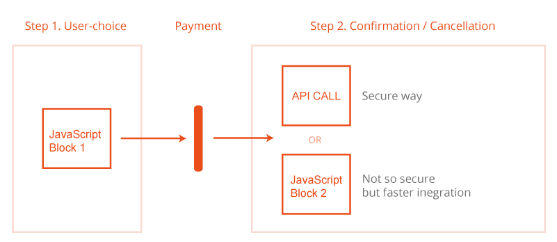

# Donation Widget V3 Overview

The WorldCoo Donation Widget offers web services that allow account customers to interact with WorldCoo systems and perform all the tasks required for them to send donations.

Built in accordance with industry standards, WorldCoo Donation Widget provides a simple and effective method for web and apps to integrate with WorldCoo and the NGO world, and and get started quickly. There are no costs to customers for using the WorldCoo Donation Widget services, but WorldCoo clients may incur their own development costs, which should be covered by the client.

WorldCoo will not accept any responsibility for any development, implementation and testing costs. Customers should address any inquiries regarding systems development to their account handler.


# Onboarding

Onboarding is a sandboxed test environment that allows you to test your integration without data being passed through to the WorldCoo operational systems. This ‘Onboarding’ environment is available 24/7, has the same functionality as live (though with a reduced capacity). 

You will be provided with a contact in WorldCoo who will take you through the onboarding process. Once you have successfully integrated your system with ours and you are able to work with our system, you will be granted access to the live system and can begin making donations. 


# Live deployment

Once you have completed all the required testing in the onboarding environment you will be provided with access to the live production system. Please use the supplied Widget ID to connect to this environment. 


# 2-Step integration

WorldCoo provides two set of resources in order to integrate the WorldCoo Widget in a faster but secure way.

* Pre-payment JavaScript block.
* Post-payment confirmation resources.




## Step 1 User-choice

In order to allow your clients to decide if they will make a donation or not, the step 1 provides an auto-generated widget with all the information available about the project in order to inform the end-user to make the final decision. Usually the generated user interface provides a simple check-box with the aim to provide an easier end-user decision.

This interface can be personalized. This allows to provide the same look & feel as the rest of your site.


> WorldCoo JavaScript loader code for step 1 (pre-payment).

```html
<script>
   window.WORLDCOO=(function (d, s, i){var w=window.WORLDCOO ||{};if (d.getElementById(i)) return w;var spt=d.createElement(s);spt.type='text/javascript';spt.async=true;spt.id=i;spt.src='https://cdn.worldcoo.com/widget/code/loader/initial/widget-min.js';var l=d.getElementsByTagName(s)[0];l.parentNode.insertBefore(spt, l);w._e=[];w.ready=function(f){w._e.push(f);};return w;})(document, 'script', 'wcjs');
</script>
```

> In order to complete the step 1, you must place and customize the following code at the place you want the widget appears:

```html
<div class="wc_widget"
  data-widget-id="f7629749-89aa-43e3-8b4b-9af3925a63ea"
  data-lang="ESP"
  data-currency="EUR"
  data-cart-amount="20">
</div>
```

### Javascript code

You must place the code shown here anyplace of your page. This will load all necessary resources for the widget to display. This code must be executed before you call any auxiliary function provided by WorldCoo widget.

Additionally, you must add a secondary block of code, this will be replaced with your customized widget in load-time. To make this possible you must provide a small set of variables so you can provide a tailored experience to your end-users:

<aside class="success">
All loads are asynchronous and will not slow down your overall load process. We are aware of the importance of this point. Additionally, all content is loaded from the nearest CDN available to your end-users and will scale at same ratio your end-users do.
</aside>


Parameter | Required | Description
---------- | ------- | -------
data-widget-id | yes | UUID field. This will identify this particular widget in your page context.
data-lang | yes | ISO 639-2/b language code. Please remember to activate this languages previously in your control panel or making a direct request to WorldCoo Support.
data-currency | yes | ISO 4271 currency code
data-cart-amount | yes | Current amount of your end-user shop cart. This allows the widget to optimize the donation amount in real time.


### Interacting with the widget

Usually you may need to interact with the widget to perform some operations and verifications.
To make this possible, WorldCoo widget provide solid methods to interact and subscribe to the most common actions, so your system can collect and process all user interactions.
This are most common use cases:

* Check if the widget is loaded.

> Check if the Widget is currently loaded

```javascript
WORLDCOO.ready(function() {
  // Interact with the WorldCoo widget here 
})
```


> Change event

```javascript
WORLDCOO.events.bind(
  'change', 
  function(response) {
    // Make something here with the response
  }
)

// Response

{
  widgetId: 'f7629749-89aa-43e3-8b4b-9af3925a63ea',
  checked: true|false,
  donationAmount: 2,
  donationId: 'ee6233f3-1d96-43f7-8fae-0da484c395d0'
}
```

* Check if the widget is initialized and if the user has checked or interact with the widget.


> Status method

```javascript
WORLDCOO.widgets.getStatus(widget-id);

// Non initialized response:
// This method can return null, which means that the widget is not initialized for any reason and won't be shown

null


// Normal response:

{
  widgetId: 'f7629749-89aa-43e3-8b4b-9af3925a63ea',
  checked: true|false,
  donationAmount: 1,
  donationId: 'ee6233f3-1d96-43f7-8fae-0da484c395d0'
}
```

* Get the current amount donated within the widget.


> Reload method

```javascript
// reload all the widgets
WORLDCOO.widgets.reload();

// or only a specific one
WORLDCOO.widgets.reload(widget-id);
```

* Reload the widget with new data or after an asyncronous reload of your web page


<aside class="warning">You must call events inside WORLDCOO.ready function</aside>

## Step 2 Donation confirmation / cancellation

At this point the end-user has been made the choice of donate (or not donate) to your campaigns. So all we need is to collect this decision and pass it to WorldCoo servers.

To achieve this, you can use a second JavaScript block which receives the data from the first block automatically. You can also implement the <a href="http://docs.worldcoo.com/api/v3" target="_blank">WorldCoo Donor API</a> from your backend. We strongly recommend the second way, being the only that ensures you a true control of the donation process. By using <a href="http://docs.worldcoo.com/api/v3" target="_blank">WorldCoo Donor API</a> you can implement controls in your backend side by side with your current processing structure.

### Javascript code

> Example of WorldCoo JavaScript loader code for step 2 (post-payment).

```html
<script>
   window.WORLDCOO=(function (d, s, i){var w=window.WORLDCOO ||{};if (d.getElementById(i)) return w;var spt=d.createElement(s);spt.type='text/javascript';spt.async=true;spt.id=i;spt.src='https://cdn.worldcoo.com/widget/code/loader/confirmation/widget-min.js';var l=d.getElementsByTagName(s)[0];l.parentNode.insertBefore(spt, l);return w;})(document, 'script', 'wcjs');
</script>
```
You must place the code anyplace at your after-payment page. This will load all necessary resources for the widget. This code must be executed before you call any auxiliary function provided by WorldCoo widget.

> Confirmation data (must be added somewhere within the page):

```html
<div class=" wc_confirm"
data-widget-id="f7629749-89aa-43e3-8b4b-9af3925a63ea"
data-api-confirmation="false"
data-lang="ESP"
data-currency="EUR"
data-checked="1"
data-amount="1"
data-order-code="7423478"
data-donor-name="Jon"
data-donor-surname="Doe"
data-donor-address="Albinyana, 29"
data-donor-mail="jondoe@worldcoo.com"
data-donor-id="47777777W">
</div>
```

In order to display the confirmation for the end-user as well as pass all data to WorldCoo, you must place and customize the following code at the place you want the widget appears, even if a donation has not been placed.

Parameter | Required | Description
---------- | ------- | -------
data-widget-id | yes | UUID field. This will identify this particular widget in your page context.
data-api-confirmation | yes | Indicates whether the donations are being confirmed via API or not
data-lang | yes | ISO 639-2/b language code. Please remember to activate this languages previously in your control panel or making a direct request to WorldCoo Support.
data-currency | yes | ISO 4271 currency code
data-checked | yes | Possible values: 1 (a donation has been placed), 0 (a donation has not been placed).
data-amount | yes | Donation amount.
data-order-code | yes | Internal shop order-code related to this order. The end-user can use this code to apply for a donation certificate.
data-donor-name | no | Name of the donor.
data-donor-surname | no | Surname of the donor.
data-donor-address | no | Address of the donor.
data-donor-mail | no | E-mail of the donor.
data-donor-id | no | Country ID number of the donor.

### API implementation


> Example of WorldCoo API donation confirmation.

```shell
curl -X PUT
-H "Authorization: <ACCESS_TOKEN>"
-H "Content-Type: application/json"
https://api.worldcoo.com/v3/donations/{{donation_id}}/confirmation
```

> Example of WorldCoo API confirmation response:

```json
{
     "id": "ee6233f3-1d96-43f7-8fae-0da484c395d0",
     "campaignId": "e07bf1c1-8c4d-4b81-b1b2-14f501b65223",
     "clientId": "e517455e-2b5f-40a6-befb-2f11cc336a2d",
     "amount": 1,
     "status": "confirmed",
     "currency": "EUR",
     "creationDate": "2017-01-16T11:07:56.000Z"
}
```

In order to confirm donations through API, you must invoke a PUT call to our API endpoint using the related example. Keep in mind you will need to store the original <strong>donation_id</strong> so you can append it to the call.

<aside class="warning">Please make sure you have your API credentials, if not contact with WorldCoo support</aside>

####  Why use API confirmation instead of the JavaScript ones?

As you have seen, placing a JavaScript code after the payment allows WorldCoo to collect all the data related to de donation as well as provide some order context. The JavaScript implementation can be reliable when all your users MUST go to this final page to reach order confirmation. Any other behaviour will not be accounted while this second JavaScript is not loaded.

<aside class="error">
If your user-flow have ramifications, post-order confirmations, or order cancellations are usually placed, please, consider seriously the <a href="http://docs.worldcoo.com/api/v3" target="_blank">API implementation</a>.
</aside>

By using <a href="http://docs.worldcoo.com/api/v3" target="_blank">API implementation</a> into the post-payment environment you can control donation confirmations as well as invalidate them from your backend.


If you are interested in using API implementation, please review the online documentation <a href='http://docs.worldcoo.com/api/v3'>here</a>.
